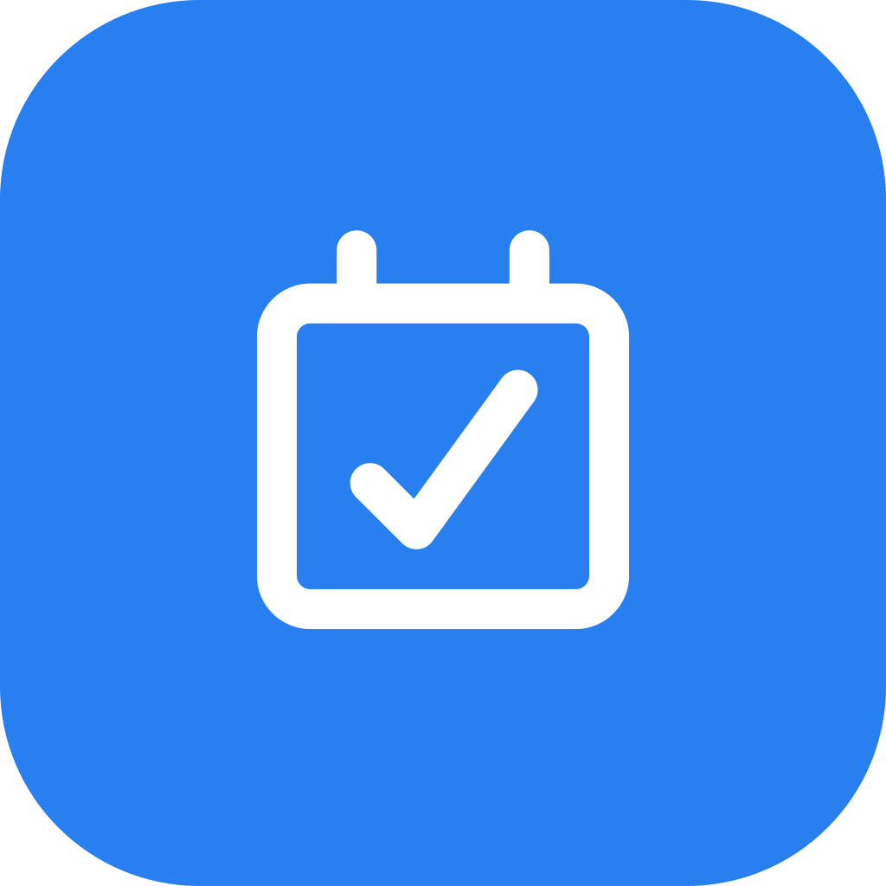

# DDL out!

<p align="center">
  
</p>

[中文](README.md) | **English** | [日本語](README.ja.md)

[](https://github.com/FlySparkle/DDL-out/actions/workflows/ci.yml)

DDL out! is a local-first deadline board. Organize tasks by their deadlines and
work without a network connection. It is built with Flutter, Riverpod, Drift,
and Material 3.

## Features

- Create, edit, delete, collapse, and move categories and tasks across categories.
- Sort tasks by deadline and show their urgency.
- Enter deadlines as relative or absolute time.
- Track completion and clear completed tasks.
- Export and restore validated, versioned JSON database backups.
- Keep data in a local SQLite database; timestamps are stored in UTC and shown
  in the local time zone.

## Platform Plan

| Platform and distribution | Status | Automation |
| --- | --- | --- |
| Windows x64 portable | Buildable | CI and tag releases |
| Windows ARM64 portable | Reserved | Manual extended-platform workflow |
| Windows MSIX | Reserved | Enabled after app identity and signing are configured |
| Linux x64 bundle, DEB, RPM | Reserved | Manual extended-platform workflow |
| Android arm64-v8a APK | Buildable | CI and tag releases |
| iOS | Reserved | Unsigned macOS build; releases require Apple signing |
| macOS | Reserved | Native host exists; release signing remains to be configured |

Reserved means that a native host or workflow entry point exists. It does not
mean a production installable package has been released.

## Quick Start

Install Flutter Stable, which includes Dart, then run these commands from the
repository root:

```powershell
flutter pub get
dart run build_runner build --force-jit
flutter gen-l10n
flutter run -d windows
```

Android development also requires JDK 21, the Android SDK, and accepted
licenses. Windows builds require Visual Studio with the Desktop development
with C++ workload. Run `flutter doctor -v` to check the environment.

## Development and Validation

```powershell
dart format --output=none --set-exit-if-changed .
flutter analyze
flutter test
flutter build windows --release
flutter build apk --release --target-platform android-arm64
```

Keep `--force-jit` for code generation on paths containing non-ASCII
characters. See the [release guide](docs/RELEASE.md) for signing, packaging,
and tag-driven releases.

## Layout

```text
lib/        Flutter application and domain code
test/       Unit and widget tests
assets/     Application assets
android/    Android host
ios/        iOS host
linux/      Linux host
macos/      macOS host
windows/    Windows host
docs/       Release, contribution, and architecture documentation
tool/       Local verification and packaging scripts
```

## Contributing

Read the [contributing guide](docs/CONTRIBUTING.md) and [code of conduct](docs/CODE_OF_CONDUCT.md).
Use the GitHub issue templates for public reports. Do not submit local
databases, backups, signing materials, or other personal data.

## License

This project is licensed under [GPL-v3](LICENSE).
